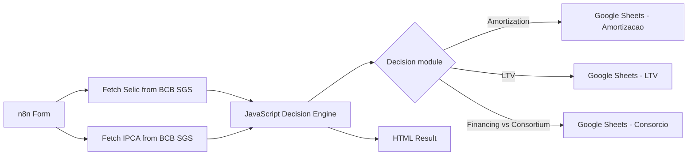

# Intelligent Debt Amortization Simulator with n8n

A decision-support workflow built with **n8n** to compare debt amortization, investing at Selic-linked returns, down-payment strategies, and financing versus consortium scenarios.

The project combines live Brazilian macroeconomic data, financial modeling, sensitivity analysis, and Monte Carlo simulation in a single automated workflow.

> **Language:** the main documentation is in English to make the project easier to evaluate internationally. A short Portuguese summary is available below.

## Why this project exists

A common personal-finance question is deceptively difficult:

> Should I use available cash to reduce debt, or keep the money invested?

The answer depends on more than a simple comparison between two headline rates. Taxes, inflation, debt structure, time horizon, opportunity cost, and uncertainty can all change the result.

This project turns that decision into a reproducible analytical workflow.

## What the workflow does

The current workflow supports three decision modules:

### 1. Debt amortization vs. investment

Compares the economic value of using an extra cash amount to reduce debt versus investing it at a Selic-linked return.

The analysis includes:

- net investment return after a simplified Brazilian regressive income-tax assumption;
- debt cost converted to equivalent monthly rates;
- NPV-style comparison of both alternatives;
- break-even Selic analysis;
- safety margin between market return and debt cost;
- Monte Carlo simulation with 1,000 scenarios;
- confidence score based on the share of simulated scenarios favoring investment.

### 2. Down-payment / LTV analysis

Estimates whether preserving liquidity or increasing the initial payment is more attractive based on the spread between the estimated net Selic return and debt cost.

Outputs include:

- current Loan-to-Value ratio;
- suggested minimum or maximum down-payment strategy;
- financed amount;
- estimated opportunity cost of additional upfront capital.

### 3. Financing vs. consortium

Compares the estimated financial cost of a conventional loan with a Brazilian consortium structure.

The workflow considers:

- financing interest cost;
- consortium administration fee;
- estimated reserve fund and insurance costs;
- waiting-period rent as an opportunity cost;
- opportunity cost of a bid (`lance`);
- equivalent consortium rate.

## Architecture



For a more detailed view, see [`docs/ARCHITECTURE.md`](docs/ARCHITECTURE.md).

## Tech stack

| Technology | Role |
| --- | --- |
| **n8n** | Workflow orchestration and form interface |
| **JavaScript / Node.js** | Financial and statistical calculation engine |
| **Banco Central do Brasil SGS API** | Live Selic and IPCA data |
| **Google Sheets** | Result persistence and audit trail |
| **HTML** | Human-readable simulation output |

## Statistical layer

The workflow runs **1,000 Monte Carlo scenarios** using normally distributed shocks generated through the **Box-Muller transform**.

For each scenario, it recalculates the relative attractiveness of investing versus amortizing under changing Selic and, when applicable, IPCA assumptions.

The resulting confidence percentage should be interpreted as a **model robustness indicator**, not as a forecast probability.

## Repository structure

```text
.
├── README.md
├── workflow_n8n_SAI.json
└── docs/
    ├── ARCHITECTURE.md
    └── MODEL_ASSUMPTIONS.md
```

## Getting started

### Prerequisites

You will need:

1. an n8n instance;
2. Google OAuth credentials configured in n8n if you want Google Sheets persistence;
3. a Google Sheets document with the tabs:
   - `Amortizacao`
   - `LTV`
   - `Consorcio`

### Import the workflow

1. Download [`workflow_n8n_SAI.json`](workflow_n8n_SAI.json).
2. In n8n, open **Workflows → Import from File**.
3. Import the JSON file.
4. Reconfigure the Google Sheets nodes with your own credential and spreadsheet.
5. Review the external API nodes and confirm the BCB SGS endpoints are reachable.
6. Open the Form Trigger and run the workflow in test mode.

## Important configuration note

The exported workflow currently contains references to the original Google Sheets document and n8n credential metadata. These references are not authentication secrets by themselves, but **you should replace them with your own configuration before using the workflow**.

For public reusable templates, removing environment-specific IDs from exported workflows is recommended.

## Main outputs

Depending on the selected module, the workflow can return:

- recommended action;
- NPV comparison;
- Selic break-even point;
- real spread estimate;
- Monte Carlo confidence score;
- average simulated gain/loss;
- LTV and suggested down-payment range;
- estimated financing and consortium costs;
- timestamped records in Google Sheets.

## Model assumptions and limitations

This is a **decision-support and portfolio project**, not a banking-grade valuation engine.

Some calculations intentionally use simplified assumptions. Examples include tax treatment, constant volatility parameters, financing cash-flow approximation, and fixed estimates for some consortium costs.

One important implementation detail is that the current financing payment formula behaves like a **fixed-payment annuity / Price-style approximation**, despite an older code comment referring to a simplified SAC calculation.

See [`docs/MODEL_ASSUMPTIONS.md`](docs/MODEL_ASSUMPTIONS.md) for the full list of assumptions and improvement opportunities.

## Roadmap

Potential next improvements:

- implement true SAC and Price amortization schedules side by side;
- calculate tax only on investment gains using holding-period cash flows;
- calibrate Selic/IPCA volatility from historical data instead of fixed parameters;
- model correlation between Selic and inflation;
- support reproducible Monte Carlo runs with seeded randomness;
- add automated tests for the JavaScript financial engine;
- move environment-specific configuration out of the exported workflow;
- add scenario comparison charts and richer reporting.

## Portuguese summary 🇧🇷

Este projeto é um simulador de apoio à decisão financeira construído no **n8n**. Ele compara amortização de dívida versus investimento, analisa estratégias de entrada/LTV e estima custos de financiamento versus consórcio.

O workflow usa dados do **Banco Central**, cálculos em **JavaScript**, análise de sensibilidade e **1.000 simulações de Monte Carlo**. O objetivo é transformar decisões financeiras que normalmente seriam feitas “no olho” em um processo analítico, automatizado e auditável.

## Disclaimer

This software is provided for educational and analytical purposes only. It does **not** constitute investment, credit, tax, accounting, or financial advice. Real-world decisions should consider contractual terms, transaction costs, taxation rules, liquidity needs, risk tolerance, and professional advice when appropriate.

---

Built as a practical project combining **automation, analytics, financial modeling, and decision science**.
