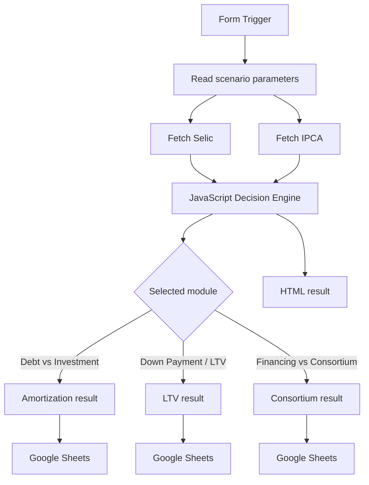

# Architecture

## Overview

The project is implemented as an n8n workflow that combines user input, public macroeconomic data, JavaScript-based financial modeling, routing logic, result persistence, and HTML presentation.

At a high level, the workflow has five layers:

1. **Input layer** — collects scenario parameters through an n8n form.
2. **Market-data layer** — retrieves current Brazilian macroeconomic data from Banco Central do Brasil (BCB) SGS endpoints.
3. **Decision engine** — runs the financial calculations, sensitivity analysis, and Monte Carlo simulation in JavaScript.
4. **Routing and persistence layer** — routes results to the appropriate module and stores outputs in Google Sheets.
5. **Presentation layer** — renders a human-readable HTML result.

## Logical flow



## Core components

### 1. n8n Form

The form is responsible for receiving the scenario assumptions. Depending on the selected mode, inputs may include:

- asset value;
- down payment;
- debt principal;
- annual debt rate;
- extra cash available for amortization/investment;
- remaining term;
- debt type;
- consortium administration fee;
- consortium term;
- expected contemplation period;
- rent during waiting period;
- bid amount.

Not every field is used by every module.

### 2. BCB SGS data retrieval

The workflow retrieves Brazilian macroeconomic series through HTTP Request nodes.

The Selic endpoint is used as the basis for the investment-return estimate. IPCA data is used when inflation-linked debt is selected and in sensitivity calculations.

External data availability is therefore a runtime dependency.

### 3. JavaScript decision engine

The central Code node acts as the analytical engine.

It currently performs:

- annualization of the retrieved Selic rate;
- simplified after-tax Selic calculation;
- IPCA accumulation;
- debt-cost normalization;
- NPV-style amortization/investment comparison;
- break-even analysis;
- safety-margin calculation;
- Monte Carlo simulation;
- LTV analysis;
- financing-versus-consortium comparison;
- output formatting and decision labels.

Because a significant share of the business logic is concentrated in one Code node, this node is the primary candidate for future refactoring and unit testing.

## Decision modules

### Debt amortization vs. investment

The module compares the economic benefit of reducing debt with the estimated return from keeping the same capital invested.

The main outputs include:

- `decisao`;
- `vpl_investir`;
- `vpl_amortizar`;
- `delta_vpl`;
- `selic_equilibrio`;
- `margem_seguranca_selic`;
- Monte Carlo metrics.

### Down-payment / LTV

The LTV module compares debt cost and net market return and derives a simple minimum-versus-maximum down-payment recommendation.

This is currently a rule-based model, not a continuous mathematical optimizer.

### Financing vs. consortium

The module estimates the cost of conventional financing and compares it with a consortium scenario after administration costs and selected opportunity costs.

The result depends heavily on assumptions such as waiting time, rent, bid value, and simplified cost estimates.

## Persistence

The workflow writes results to separate Google Sheets tabs:

- `Amortizacao`;
- `LTV`;
- `Consorcio`.

This provides a lightweight audit trail and makes it easy to inspect or analyze simulation history outside n8n.

For a production deployment, a database would provide stronger schema enforcement, versioning, access control, and analytical scalability.

## Current coupling

The exported workflow includes environment-specific Google Sheets references and credential metadata. These should be treated as configuration and replaced when the workflow is imported into another environment.

A cleaner future architecture would separate:

- workflow logic;
- environment configuration;
- calculation engine;
- persistence adapter;
- UI/presentation logic.

## Suggested future architecture

A stronger production-oriented version could use:

```text
n8n
├── input orchestration
├── external API calls
├── validation
└── execution routing

financial-engine/
├── rates.js
├── amortization.js
├── consortium.js
├── monte-carlo.js
└── tests/

storage/
└── database or Sheets adapter
```

This would keep n8n focused on orchestration while moving the analytical model into independently testable code.
